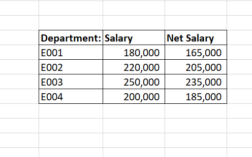

# Excel Lookup Project

## 🧰 Topic: VLOOKUP in Excel (Since XLOOKUP is not available in Office 2019)

### 🧪 Project: Employee Salary Lookup

This workbook contains:
- A master employee table
- A reference salary(Table1) + department table(Table2)
- Lookup implementation using `VLOOKUP`
- Net Salary calculated with flat tax of ₦15,000

### 📂 Sheets:
- **Sheet1** – Raw Employee Data
- **TASK** – VLOOKUP with Department & Salary + Net Salary

### ✅ Tools Used:
- Microsoft Excel 2019 (Professional Plus)
- `VLOOKUP` instead of `XLOOKUP` due to version limitations
  
## 📷 Screenshots

### ✅ VLOOKUP Setup View

### ✅ Final Lookup Result with Net Salary

